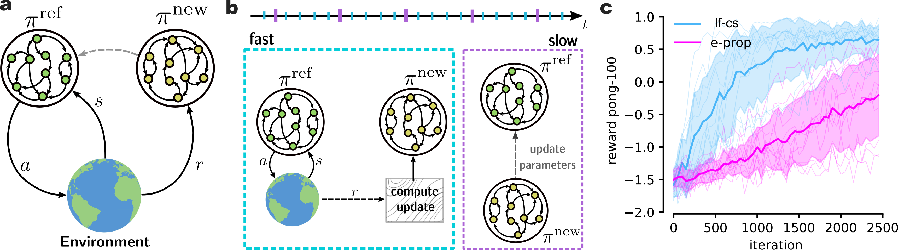

# Learning fast while changing slow in spiking neural networks

Official implementation of the _Learning fast while changing slow in spiking neural networks_ paper (_Under Review_).

To reproduce the core result of Figure 1 of the paper one should run the following.

```bash
# Compute results for the LF-CS case (fast timescale updates)
python pong.py -n_rep 5 -tau fast -n_replays 2 -save_dir <path_to_data>

# Compute results for the e-prop case (slow timescale updates)
python pong.py -n_rep 5 -tau slow -n_replay 1  -save_dir <path_to_data>
```

One can then simply visualize the results by running:

```bash
# Reproduce the plot from Fig. 1c
python show_result.py -n_rep 5 -load_dir <path_to_data> -save_dir <path_to_imgs>
```


